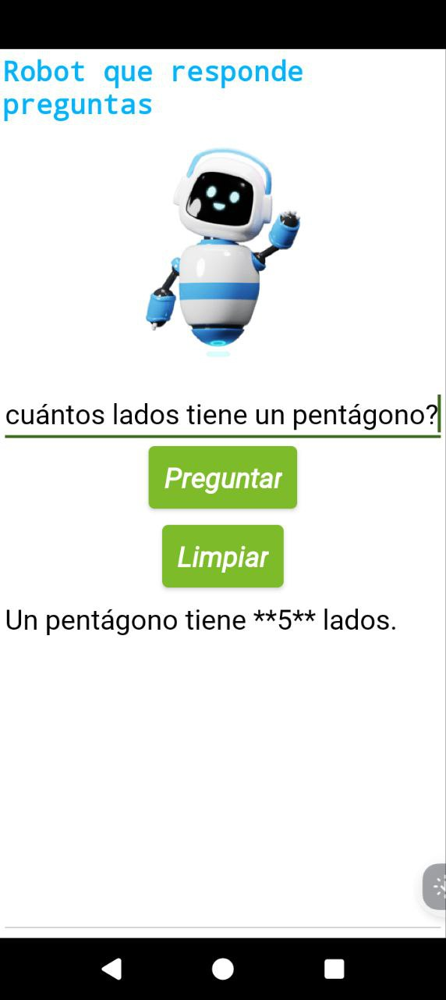
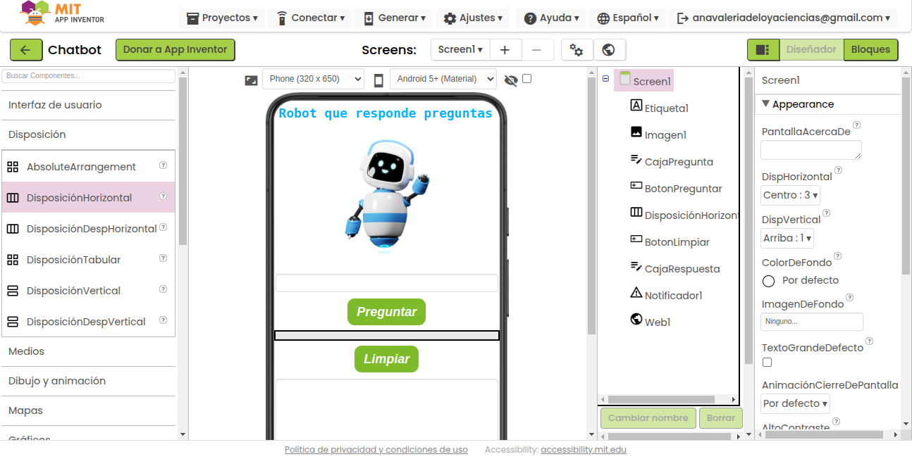

# Creación de un Chatbot

- Es una aplicación para dispositivos móviles hecha en MIT App Inventor mediante la cual es posible hacerle preguntas a Gemini, la Inteligencia Artificial de Google.

  

## Implementación

  

## 

Para su uso basta con que el usuario descargue en su dispositivo móvil (con sistema operativo Android): Chatbot.apk
